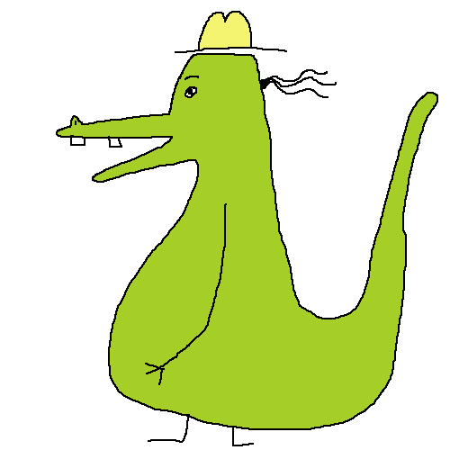

  
  

    
    
      
    

<h2>Hello, Dragon!</h2>

---

### :technologist: About Me:

#### I am an :artist: artist, :cook: cook, :farmer: gardner, and full stack developer.

* :telescope: I'm currently enrolled in [Epicodus](learnhowtoprogram.com)
  * I've learned Javascript, C#, .NET, and moving into learning React
  * I love making gifs and hiding them in my projects
* :seedling: Exploring functional programming
* :zap: In my free time, I like working on building out my artist website, solving sudokus, eating :fish: anchovies, and making art.
* :mailbox: How to reach me: 
